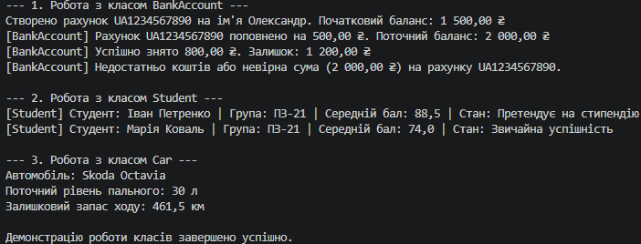

# Самостійна робота №1
**Тема:** Базовий синтаксис C# і оголошення класів.  
**Навчальний заклад:** Рівненський фаховий коледж інформаційних технологій  
**Предмет:** Об'єктно-орієнтоване програмування  

---

## Опис проєкту
У рамках самостійної роботи створено консольний проєкт `IndependentWork1` мовою C#. В ньому реалізовано 3 класи для моделювання об'єктів реального світу з інкапсуляцією даних, різними типами полів та логікою поведінки:

1. **`BankAccount` (Банківський рахунок):**
   - **Поля:** `_accountNumber`, `_ownerName`, `_balance`.
   - **Властивості:** read-only `AccountNumber`, класичні властивості для `OwnerName` та `Balance`.
   - **Методи:** `Deposit(amount)` для поповнення та `Withdraw(amount)` для перевірки/зняття коштів.

2. **`Student` (Студент):**
   - **Поля:** `_fullName`, `_group`, `_averageGrade`.
   - **Властивості:** read-only `FullName`, властивості з валідацією діапазону балів (0–100) для `AverageGrade`.
   - **Методи:** `IsEligibleForScholarship()` (перевірка стану) та `PrintStudentCard()`.

3. **`Car` (Автомобіль):**
   - **Поля:** `_brand`, `_fuelTankCapacity`, `_fuelConsumptionPer100km`, `_currentFuelLevel`.
   - **Властивості:** read-only `Brand`, властивість `CurrentFuelLevel`.
   - **Методи:** `CalculateRange()` для розрахунку залишкового запасу ходу (в кілометрах).

---

## Відповіді на контрольні запитання

1. **Які мінімальні елементи повинен містити клас у цьому завданні?**
   Клас у цьому завданні повинен містити:
   - Мінімум 2 приватних поля для збереження внутрішнього стану об'єкта.
   - Мінімум 1 публічну властивість (`get`/`set` або read-only) для доступу до полів.
   - Конструктор із параметрами для початкової ініціалізації полів.
   - Насамперед 1 метод для реалізації обчислювальної логіки або перевірки стану об'єкта.

2. **Чому поля доцільно робити приватними, а доступ до них надавати через властивості?**
   Це базовий принцип об'єктно-орієнтованого програмування — **інкапсуляція**. Приватні поля захищають дані об'єкта від неконтрольованої зовнішньої зміни. Властивості ж виступають «захисним бар'єром», який дозволяє перевіряти вхідні значення (валідація), робити дані доступними лише для читання або виконувати додаткову логіку під час зчитування чи запису.

3. **Для чого в класі потрібен конструктор і як він пов’язаний зі станом об’єкта?**
   Конструктор — це спеціальний метод класу, який викликається автоматично під час створення нового екземпляра (через оператор `new`). Він потрібен для того, щоб задати початковий коректний стан об'єкта (ініціалізувати його приватні поля переданими значеннями) до того, як об'єкт почне використовуватися в програмі.

4. **Як у `Main` показати, що методи класу працюють коректно?**
   У `Main` створюються екземпляри класів із реальними вхідними даними через конструктори. Після цього послідовно викликаються їхні методи (наприклад, поповнення/зняття коштів, перевірка успішності, розрахунок дистанції) з виводом отриманих результатів та значень властивостей у консоль. Зміна стану об'єкта та форматований вивід результатів підтверджують правильність алгоритмів.

---

## Висновок

Під час виконання самостійної роботи №1 я закріпив практичні навички роботи з базовим синтаксисом мови C# та принципами об'єктно-орієнтованого програмування. 

я навчився правильно оголошувати класи для предметних галузей реального світу (`BankAccount`, `Student`, `Car`), використовувати приховування даних (інкапсуляцію) за допомогою приватних полів, реалізовувати read-only та стандартні властивості, ініціалізувати об'єкти через конструктори та описувати методи для виконання обчислень чи перевірки стану. Продемонстрована у `Program.cs` робота підтверджує коректність функціонування створених структур.

