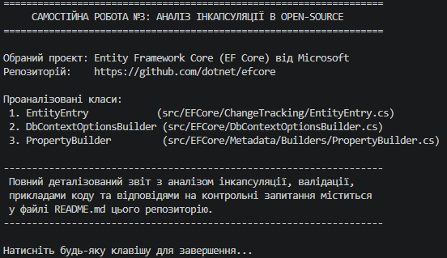

# Самостійна робота №3
**Тема:** Аналіз інкапсуляції в open-source проєктах. Практики валідації полів.  
**Навчальний заклад:** Рівненський фаховий коледж інформаційних технологій  
**Предмет:** Об'єктно-орієнтоване програмування  

---

# Звіт з аналізу інкапсуляції в Open-Source проєкті

## 1. Обраний проєкт
- **Назва:** Entity Framework Core (EF Core)
- **Розробник:** Microsoft
- **Посилання на GitHub:** [https://github.com/dotnet/efcore](https://github.com/dotnet/efcore)
- **Мова програмування:** C# (.NET Framework / .NET Standard / .NET Core)
- **Опис проєкту:** Офіційна об'єктно-реляційна система відображення (ORM) для .NET, яка дає змогу розробникам працювати з реляційними базами даних за допомогою об'єктів .NET.

---

## 2. Аналіз інкапсуляції

### Клас 1: `EntityEntry`
- **Файл на GitHub:** [`src/EFCore/ChangeTracking/EntityEntry.cs`](https://github.com/dotnet/efcore/blob/main/src/EFCore/ChangeTracking/EntityEntry.cs)
- **Опис класу:** Представляє інформацію відстеження змін для окремої сутності у контексті `DbContext`. Виступає «фасадом» або обгорткою навколо внутрішнього стану `InternalEntityEntry`.
- **Поля:** 
  Усі внутрішні поля класу є приватними або захищеними (наприклад, `_internalEntry`), щоб унеможливити прямий доступ до механізму відстеження станів.
```csharp
// Приклад приватної інкапсуляції
private readonly InternalEntityEntry _internalEntry;
```

