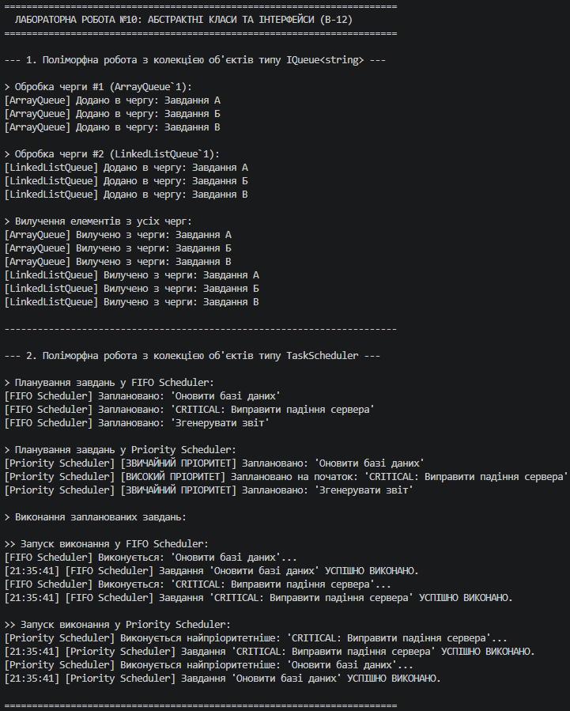

# Лабораторна робота №10. Абстрактні класи та інтерфейси. Контракти та реалізації

**Варіант:** 12  
**Назва предметної області:**  
- **Інтерфейс:** `IQueue<T>` → `ArrayQueue<T>`, `LinkedListQueue<T>`  
- **Абстрактний клас:** `TaskScheduler` → `FifoScheduler`, `PriorityScheduler`  
**Предмет:** Об'єктно-орієнтоване програмування  
**Навчальний заклад:** Рівненський фаховий коледж інформаційних технологій  

---

## 📋 Опис реалізованих контрактів та класів

### 1. Контракт інтерфейсу `IQueue<T>`
Визначає уніфікований контракт для структури даних "Черга":
- `void Enqueue(T item)` — додавання елемента.
- `T Dequeue()` — вилучення елемента.
- `bool IsEmpty { get; }` — перевірка на наявність елементів.

**Реалізації:**
* `ArrayQueue<T>` — реалізація черги на основі динамічного масиву `List<T>`.
* `LinkedListQueue<T>` — реалізація черги на основі двозв'язного списку `LinkedList<T>`.

### 2. Абстрактний клас `TaskScheduler`
Визначає шаблон алгоритму та спільну логіку планування та виконання завдань:
- `abstract void ScheduleTask(string taskName)` — абстрактний метод планування.
- `abstract void ExecuteNextTask()` — абстрактний метод виконання.
- `void LogTaskCompletion(string taskName)` — **конкретний метод спільної логіки** базового класу для логування часу та результату виконання.

**Похідні класи:**
* `FifoScheduler` — реалізує стандартну послідовну чергу виконання тип "першим прийшов — першим виконався".
* `PriorityScheduler` — реалізує виконання із врахуванням пріоритету завдань (критичні завдання обробляються першочергово).

---

## ❓ Відповіді на контрольні запитання

### 1. У чому полягає основна відмінність між абстрактним класом та інтерфейсом?
* **Абстрактний клас** виражає відношення **"IS-A" (є)**. Він представляє частково реалізовану сутність, може містити стан (поля, властивості), конструктори, модифікатори доступу (`protected`, `private`) та конкретні методи зі спільною логікою.
* **Інтерфейс** виражає відношення **"CAN-DO" (вміє робити)**. Він є чистим контрактом без стану, описує лише поведінку (методи, властивості), яку може реалізувати будь-який клас, незалежно від його положення в ієрархії успадкування.

### 2. Коли доцільно використовувати абстрактний клас, а коли — інтерфейс? Наведіть приклади.
* **Абстрактний клас доцільний**, коли класи тісно пов'язані спільною природою та мають спільний код/стан. *Приклад:* `TaskScheduler` містить спільний метод `LogTaskCompletion()`, який однаково використовується у всіх планувальниках.
* **Інтерфейс доцільний**, коли потрібно визначити спільну поведінку для абсолютно різних класів, або коли потрібне множинне визначення поведінки. *Приклад:* `IQueue<T>` визначає контракт черги, який реалізується як масивом, так і зв'язаним списком.

### 3. Чи може клас успадковувати від кількох абстрактних класів? А реалізовувати кілька інтерфейсів?
* **Множинне успадкування класів у C# заборонене:** клас може успадковувати **лише один** абстрактний (або звичайний) клас.
* **Реалізація декількох інтерфейсів дозволена:** один клас може реалізовувати **необмежену кількість** інтерфейсів (наприклад, `class MyClass : TaskScheduler, IQueue<string>, IDisposable`).

### 4. Як абстрактні класи та інтерфейси сприяють поліморфізму та гнучкості архітектури?
1. **Слабке зв'язування (Loose Coupling):** Клієнтський код залежить від абстракції (`IQueue<T>` або `TaskScheduler`), а не від конкретної реалізації.
2. **Розширюваність (Open/Closed Principle):** Додавання нового типу черги або планувальника не вимагає внесення змін у вже існуючий код клієнта або сервісу.
3. **Поліморфна обробка:** Можливість зберігати різні реалізації у колекціях базового типу (`List<IQueue<T>>` та `List<TaskScheduler>`) та обробляти їх в єдиному циклі.

---

## 📝 Висновок

Під час виконання лабораторної роботи №10 було практично опановано створення та застосування інтерфейсів й абстрактних класів. На прикладі `IQueue<T>` та `TaskScheduler` доведено переваги використання інтерфейсів для створення чистих контрактів поведінки та абстрактних класів — для повторного використання спільної логіки.

