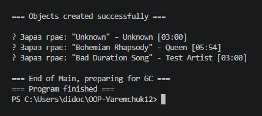

# Звіт з Лабораторної Роботи №2

**Тема:** Клас із кількома конструкторами. Життєвий цикл об’єкта  
**Дисципліна:** Об’єктно-орієнтоване програмування  
**Студент:** *[Ваше Прізвище та Ім'я]*  
**Група:** *[Назва вашої групи]*  
**Варіант:** *[Номер вашого варіанту]*  

---

## 1. Мета роботи
Навчитися реалізовувати перевантажені конструктори в C#, дослідити порядок їх викликів (зокрема ланцюговий виклик за допомогою `: this()`), задіяти валідацію даних у властивостях та опанувати основи життєвого циклу об’єктів у середовищі .NET.

---

## 2. Короткі теоретичні відомості
* **Перевантаження конструкторів:** можливість оголошення кількох конструкторів для гнучкої ініціалізації об’єкта.
* **Ланцюговий виклик (`: this(...)`):** спосіб перенаправлення виклику з одного конструктора на інший для уникнення дублювання коду.
* **Життєвий цикл об’єкта:** виділення пам'яті (`new`) $\rightarrow$ використання $\rightarrow$ вилучення збирачем сміття (Garbage Collector).
* **Деструктор (`~ClassName()`):** метод, який викликається автоматично перед видаленням об'єкта з пам'яті.

---

## 3. Хід роботи
1. **Створення проєкту:** Створено новий консольний проєкт за допомогою .NET CLI (`dotnet new console`).
2. **Проєктування класу `Song`:**
   * Оголошено приватні поля (`_title`, `_artist`, `_durationSeconds`).
   * Реалізовано публічні властивості, включно з валідацією для тривалості пісні (`DurationSeconds > 0`).
   * Реалізовано перевантажені конструктори: параметризований та конструктор за замовчуванням, який викликає перший через `: this(...)`.
   * Додано метод `Play()` для імітації відтворення та деструктор `~Song()` для відстеження видалення об'єкта.
3. **Демонстрація в `Main`:** Створено об’єкти за допомогою різних конструкторів, перевірено валідацію, викликано методи класу та продемонстровано роботу збирача сміття за допомогою `GC.Collect()`.

---

## 4. Висновок
Під час виконання роботи було засвоєно класичні прийоми ООП у C#: перевантаження та ланцюгове зв'язування конструкторів, валідацію даних у властивостях, а також відстежено всі етапи життєвого циклу об’єктів від їх створення до вилучення з пам'яті Garbage Collector-ом.!

# Звіт з Лабораторної Роботи №2

**Тема:** Клас із кількома конструкторами. Життєвий цикл об’єкта  
**Дисципліна:** Об’єктно-орієнтоване програмування  
**Студент:** *[Ваше Прізвище та Ім'я]*  
**Група:** *[Назва вашої групи]*  
**Варіант:** *[Номер вашого варіанту]*  

---

## 1. Мета роботи
Навчитися реалізовувати перевантажені конструктори в C#, дослідити порядок їх викликів (зокрема ланцюговий виклик за допомогою `: this()`), задіяти валідацію даних у властивостях та опанувати основи життєвого циклу об’єктів у середовищі .NET.

---

## 2. Короткі теоретичні відомості
* **Перевантаження конструкторів:** можливість оголошення кількох конструкторів для гнучкої ініціалізації об’єкта.
* **Ланцюговий виклик (`: this(...)`):** спосіб перенаправлення виклику з одного конструктора на інший для уникнення дублювання коду.
* **Життєвий цикл об’єкта:** виділення пам'яті (`new`) $\rightarrow$ використання $\rightarrow$ вилучення збирачем сміття (Garbage Collector).
* **Деструктор (`~ClassName()`):** метод, який викликається автоматично перед видаленням об'єкта з пам'яті.

---

## 3. Хід роботи
1. **Створення проєкту:** Створено новий консольний проєкт за допомогою .NET CLI (`dotnet new console`).
2. **Проєктування класу `Song`:**
   * Оголошено приватні поля (`_title`, `_artist`, `_durationSeconds`).
   * Реалізовано публічні властивості, включно з валідацією для тривалості пісні (`DurationSeconds > 0`).
   * Реалізовано перевантажені конструктори: параметризований та конструктор за замовчуванням, який викликає перший через `: this(...)`.
   * Додано метод `Play()` для імітації відтворення та деструктор `~Song()` для відстеження видалення об'єкта.
3. **Демонстрація в `Main`:** Створено об’єкти за допомогою різних конструкторів, перевірено валідацію, викликано методи класу та продемонстровано роботу збирача сміття за допомогою `GC.Collect()`.

---

## 4. Висновок
Під час виконання роботи було засвоєно класичні прийоми ООП у C#: перевантаження та ланцюгове зв'язування конструкторів, валідацію даних у властивостях, а також відстежено всі етапи життєвого циклу об’єктів від їх створення до вилучення з пам'яті Garbage Collector-ом.!

