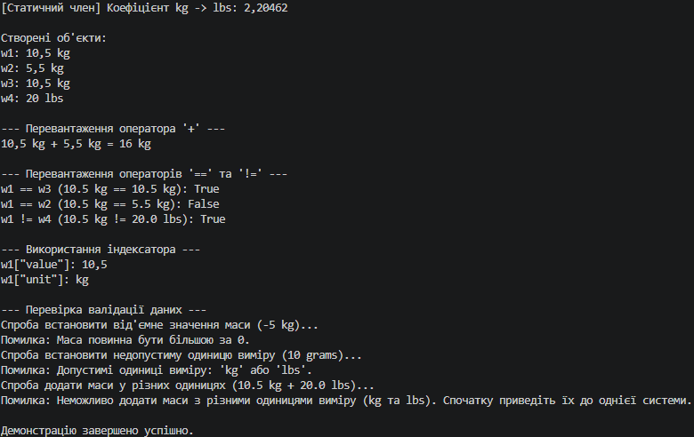

# Лабораторна робота №4
**Тема:** Властивості та статичні члени. Індексатори й перевантаження операторів.  
**Варіант:** 12 (Клас `Weight`)  
**Навчальний заклад:** Рівненський фаховий коледж інформаційних технологій  

---

## Опис проєкту
У межах лабораторної роботи реалізовано клас `Weight` (Маса), який містить:
- **Приватні поля:** `_value` (маса) та `_unit` (одиниця виміру).
- **Властивості з валідацією:** 
  - `Value`: дозволяє встановлювати лише значення $> 0$.
  - `Unit`: підтримує лише строки `"kg"` та `"lbs"`.
- **Статичний член:** `KilogramToPoundRatio` (значення $2.20462$).
- **Індексатор:** доступ до елементів за текстовим ключем (`"value"` / `"unit"`).
- **Перевантажені оператори:** 
  - `+` — додавання об'єктів з однаковими одиницями виміру.
  - `==` та `!=` — логічне порівняння об'єктів маси.
- **Перевизначені методи:** `ToString()`, `Equals()`, `GetHashCode()`.

---

## Відповіді на контрольні запитання

1. **Яка різниця між звичайною властивістю та індексатором?**
   Звичайна властивість дає доступ до конкретного поля/показника об'єкта за іменем (наприклад, `object.Value`). Індексатор дозволяє звертатися до об'єкта класу так, ніби це масив або словник, приймаючи один або декілька параметрів-індексів у квадратних дужках (наприклад, `object["value"]`).

2. **Навіщо потрібно перевизначати `Equals()` та `GetHashCode()` при перевантаженні операторів `==` та `!=`?**
   Оператори `==` та `!=` за замовчуванням порівнюють посилання для референтних типів. Якщо їх перевизначити для порівняння значень, важливо дотримуватись консистентності: методи `Equals()` та `GetHashCode()` мають використовувати ту саму логіку порівняння. Це необхідно для коректної роботи об'єктів у колекціях (наприклад, `HashSet<T>`, `Dictionary<TKey, TValue>`).

3. **У яких випадках доцільно використовувати статичні члени класу?**
   Статичні члени доцільно використовувати тоді, коли поле, властивість або метод належать всьому класу в цілому, а не конкретному його екземпляру. Наприклад: константи, загальні коефіцієнти конвертації (як `KilogramToPoundRatio`), лічильники створених об'єктів або допоміжні/математичні методи.

4. **Як інкапсуляція допомагає підтримувати цілісність даних у класі, який ви реалізували?**
   Завдяки закритим приватним полям (`_value`, `_unit`) та контролю доступу через властивості, зовнішній код не може довільно змінити стан об'єкта на некоректний (наприклад, встановити від'ємну масу або неіснуючу одиницю виміру). Логіка валідації в аксесорах `set` гарантує цілісність та коректність внутрішніх даних об'єкта протягом усього його життєвого циклу.

---

## Висновок

Під час виконання лабораторної роботи №4 я поглибив знання з об'єктно-орієнтованого програмування на платформі .NET, опанувавши механізми створення властивостей із валідацією, статичних членів, індексаторів та перевантаження операторів.

На прикладі класу `Weight` було реалізовано повноцінний тип даних із захистом від некоректного вводу (перевірка маси $> 0$ та підтримка лише дозволених одиниць `"kg"` і `"lbs"`). Перевантаження оператора додавання `+` дозволило органічно підсумовувати маси, а перевизначення операторів `==`, `!=` та методів `Equals()`, `GetHashCode()`, `ToString()` забезпечило коректне порівняння та зручне текстове представлення об'єктів. Практичні навички, здобуті під час роботи, сприяють створенню виразних, надійних та захищених класів у мові C#.

