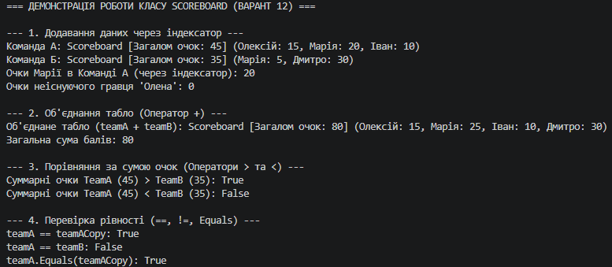

# Лабораторна робота №5. Індексатори та перевантаження операторів

**Варіант:** 12  
**Клас:** `Scoreboard` (Табло результатів)  
**Предмет:** Об'єктно-орієнтоване програмування  
**Навчальний заклад:** Рівненський фаховий коледж інформаційних технологій  

---

## Висновок

Під час виконання лабораторної роботи №5 було засвоєно практичні навички створення індексаторів та перевантаження стандартних операторів у мові C#.

### Основні досягнуті результати:
1. **Реалізація індексатора (`this[string playerName]`):**
   - Реалізовано зручний доступ до внутрішнього сховища `Dictionary<string, int>` за текстовим ключем (ім'ям гравця).
   - Забезпечено безпечну обробку відсутніх ключів (повернення `0` за замовчуванням) та захист від некоректних аргументів (`string.IsNullOrWhiteSpace`).

2. **Перевантаження операторів:**
   - Перевантажено оператор `+` для коректного об'єднання двох об'єктів `Scoreboard` із підсумовуванням балів спільних гравців.
   - Реалізовано оператори порівняння `>` та `<` для зіставлення двох табло за їхньою загальною сумою очок (`TotalScore()`).
   - Перевантажено оператори парної перевірки рівності `==` та `!=`.

3. **Дотримання контрактів .NET Framework:**
   - Перевизначено методи `Equals()` та `GetHashCode()`, що є обов'язковою вимогою при перевантаженні операторів `==` та `!=` для збереження коректної поведінки об'єктів у колекціях та хеш-таблицях.
   - Перевизначено метод `ToString()` для виводу інформації про табло у зручному та читабельному вигляді.

Використання індексаторів та перевантаження операторів дозволило підвищити рівень абстракції коду, зробивши роботу з власним класом `Scoreboard` так само інтуїтивно зрозумілою та виразною, як і з вбудованими типами даних C#.

