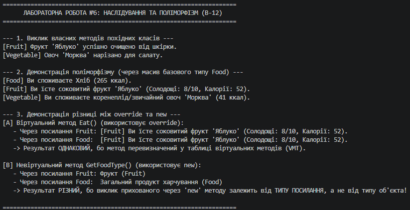

# Лабораторна робота №6. Наслідування, ключові слова base, override, virtual та приховування членів (new)

**Варіант:** 12  
**Предмет:** Об'єктно-орієнтоване програмування  
**Навчальний заклад:** Рівненський фаховий коледж інформаційних технологій  

---

## 📋 Короткий опис реалізованої ієрархії

У роботі реалізовано ієрархію продуктів харчування:
* **`Food` (Базовий клас)** — містить загальні властивості `Name` та `Calories`, конструктор, віртуальний метод `virtual void Eat()` та невтральний метод `GetFoodType()`.
* **`Fruit` (Похідний клас від Food)** — додає властивість `SweetnessLevel`, викликає `base(name, calories)`, перевизначає метод `override void Eat()`, реалізує унікальний метод `Peel()` та приховує базовий метод за допомогою `new string GetFoodType()`.
* **`Vegetable` (Похідний клас від Food)** — додає властивість `IsLeafy`, викликає `base(...)`, перевизначає `override void Eat()` та реалізує унікальний метод `Chop()`.

