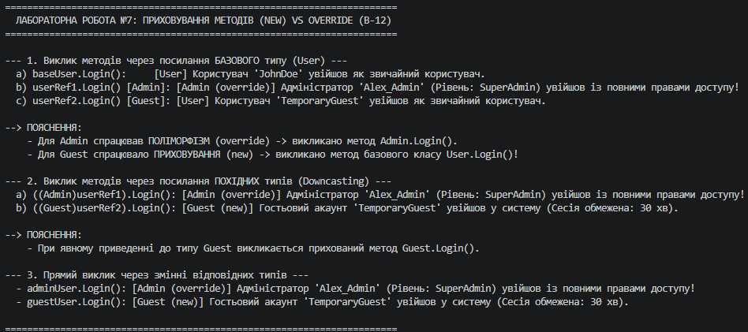

# Лабораторна робота №7. Приховування методів (new) vs Перевизначення (override)

**Варіант:** 12  
**Назва ієрархії:** `User` → `Admin` (override) / `Guest` (new)  
**Предмет:** Об'єктно-орієнтоване програмування  
**Навчальний заклад:** Рівненський фаховий коледж інформаційних технологій  

---

## 📋 Опис реалізованої ієрархії

У роботі реалізовано ієрархію облікових записів користувачів:
1. **`User` (Базовий клас):**
   - Властивість: `Username`.
   - Віртуальний метод: `virtual void Login()`.
2. **`Admin` (Похідний клас A — `override`):**
   - Перевизначає метод `Login()` за допомогою ключового слова `override`.
   - Забезпечує динамічний поліморфізм.
3. **`Guest` (Похідний клас B — `new`):**
   - Приховує метод `Login()` за допомогою модифікатора `new`.
   - Використовує статичне зв'язування (поведінка залежить від типу посилання).

---

## ❓ Відповіді на контрольні запитання

### 1. У чому полягає різниця між `override` та `new` при роботі з методами?
* **`override`:** Перевизначає метод у таблиці віртуальних методів (VMT). Викликаний метод визначається **за реальним типом об'єкта в пам'яті** (динамічне зв'язування).
* **`new`:** Приховує успадкований метод і створює новий, незалежний метод у похідному класі. Викликаний метод визначається **за типом посилання/змінної** (статичне зв'язування).

### 2. Що таке поліморфізм і як `override` його забезпечує?
**Поліморфізм** — це можливість об'єктів різних класів реагувати по-різному на один і той самий виклик методу.  
`override` забезпечує поліморфізм шляхом перезапису адреси віртуального методу в VMT. Завдяки цьому при виклику `userRef.Login()` середовище виконання CLR перевіряє таблицю фактичного об'єкта в пам'яті та викликає саме перевизначений метод похідного класу.

### 3. Чому при використанні `new` не відбувається динамічного зв’язування?
При використанні `new` комбінація методів базового та похідного класів **не створює запис у VMT** для поліморфного зв'язку. Компілятор бачить `new` метод як абсолютно новий, не пов'язаний із базовим методом. Пошук і виклик методу відбувається ще під час компіляції (статично) на основі оголошеного типу змінної.

### 4. Коли доцільно використовувати `new` замість `override`?
Модифікатор `new` використовується у рідкісних випадках:
1. Коли потрібно додати метод у похідний клас із таким же ім'ям, як у базовому, але **базовий метод не є віртуальним (`virtual`)**.
2. Коли похідний клас навмисно має розірвати поліморфний ланцюжок поведінки базового класу.
3. Коли розробник похідного класу свідомо створює нову функціональність, яка не повинна викликатися через посилання на базовий тип.

### 5. Що станеться, якщо забути вказати `new` при приховуванні?
Якщо похідний клас визначає метод із таким самим ім'ям і сигнатурою, як і в базовому класі, але не вказує ні `override`, ні `new`:
* Програма **все одно скомпілюється і буде працювати так, ніби вказано `new`** (тобто відбудеться приховування).
* Компілятор C# згенерує попередження (`warning CS0108`), рекомендуючи явно додати модифікатор `new` для підтвердження наміру розробника.

---

## 📝 Висновок

Під час виконання лабораторної роботи №7 було детально досліджено різницю між перевизначенням методів (`override`) та їх приховуванням (`new`). На прикладі ієрархії `User` → `Admin` / `Guest` практично доведено, що `override` реалізує динамічний поліморфізм, а `new` виконує статичне приховування, залежне від типу посилання.

