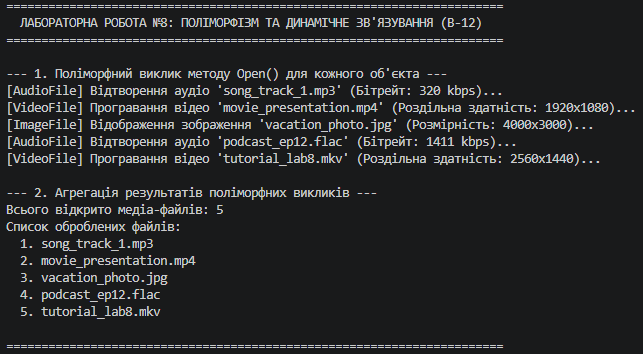

# Лабораторна робота №8. Поліморфізм: динамічне зв’язування та перевизначення методів

**Варіант:** 12  
**Назва ієрархії:** `MediaFile` → `AudioFile`, `VideoFile`, `ImageFile`  
**Предмет:** Об'єктно-орієнтоване програмування  
**Навчальний заклад:** Рівненський фаховий коледж інформаційних технологій  

---

## 📋 Опис реалізованої ієрархії

У роботі реалізовано ієрархію медіа-файлів:
1. **`MediaFile` (Базовий клас):**
   - Властивість: `FileName`.
   - Віртуальний метод: `virtual void Open()`.
2. **`AudioFile` (Похідний клас):**
   - Властивість: `BitRate` (кбіт/с).
   - Перевизначений метод: `override void Open()`.
3. **`VideoFile` (Похідний клас):**
   - Властивість: `Resolution` (роздільна здатність).
   - Перевизначений метод: `override void Open()`.
4. **`ImageFile` (Похідний клас):**
   - Властивість: `Dimensions` (розмірність пікселів).
   - Перевизначений метод: `override void Open()`.

---

## ❓ Відповіді на контрольні запитання

### 1. Що таке поліморфізм і як він реалізується в C# за допомогою `virtual` та `override`?
**Поліморфізм** — це фундаментальний принцип ООП, який дозволяє об'єктам різних похідних класів оброблятися через єдиний інтерфейс базового класу, але демонструвати власну унікальну поведінку під час виклику методів.  
В C# він реалізується через комбінацію:
* `virtual`: модифікатор у базовому класі, який дозволяє перевизначати метод у похідних класах.
* `override`: модифікатор у похідному класі, який вказує на нову реалізацію віртуального методу базового класу.

### 2. Поясніть поняття динамічного зв’язування. Чим воно відрізняється від статичного?
* **Динамічне зв’язування (Late Binding):** Визначення того, яка саме реалізація методу буде виконана, відбувається **під час виконання програми (Runtime)** на основі фактичного типу об'єкта в пам'яті (через таблицю віртуальних методів — VMT).
* **Статичне зв’язування (Early Binding):** Адреса методу зв'язується **під час компіляції (Compile Time)** на основі оголошеного типу змінної (наприклад, для невіртуальних методів або при використанні модифікатора `new`).

### 3. Наведіть приклад, як поліморфізм дозволяє писати більш гнучкий та розширюваний код.
Поліморфізм реалізує принцип відкритості/закритості (Open/Closed Principle). Наприклад, якщо додати новий тип медіа-файлу `DocumentFile : MediaFile`, який перевизначає метод `Open()`, нам **не потрібно змінювати код циклу обробки або колекції в `Main`**. Код залишається універсальним і працює з будь-яким новим похідним класом автоматично.

### 4. Які переваги дає використання колекцій базових типів?
1. **Однорідне збереження:** Можливість зберігати в одній колекції (наприклад, `List<MediaFile>`) об'єкти різних похідних типів (`AudioFile`, `VideoFile`, `ImageFile`).
2. **Уніфікована обробка:** Можливість проходити по колекції єдиним циклом і викликати спільні методи без необхідності перевірки або приведення типів (`is`/`as`/downcasting).
3. **Спрощення агрегації:** Зручність у зборі підсумкової статистики (підрахунок кількості, знаходження суми, агрегація назв дій тощо) для всієї групи об'єктів.

---

## 📝 Висновок

Під час виконання лабораторної роботи №8 було практично освоєно механізми поліморфізму та динамічного зв'язування в C#. На прикладі ієрархії `MediaFile` було продемонстровано збереження різних типів медіа-файлів у єдиній колекції `List<MediaFile>`, виконання уніфікованого виклику віртуального методу `Open()` для кожного екземпляра та проведено агрегацію результатів виконання.

