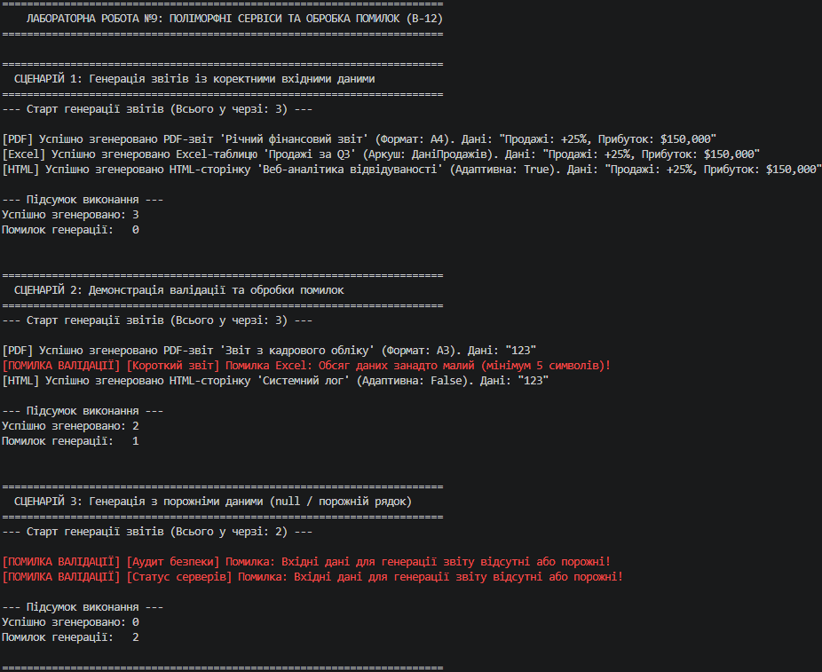

# Лабораторна робота №9. Поліморфні сервіси: Система генерації звітів (ReportGenerator)

**Варіант:** 12  
**Назва ієрархії:** `ReportGenerator` → `PDFReport`, `ExcelReport`, `HTMLReport`  
**Предмет:** Об'єктно-орієнтоване програмування  
**Навчальний заклад:** Рівненський фаховий коледж інформаційних технологій  

---

## 📋 Опис реалізованої ієрархії та сервісу

У роботі реалізовано поліморфну систему генерації звітів із валідацією даних та централізованою обробкою винятків:

1. **`ReportGenerator` (Абстрактний базовий клас):**
   - Властивість: `ReportTitle`.
   - Захищений метод валідації: `ValidateData(string data)`.
   - Абстрактний метод: `abstract void Generate(string data)`.
2. **`PDFReport` (Похідний клас):**
   - Властивість: `PageSize` (формат сторінки).
   - Реалізує генерацію PDF-документів з перевіркою даних.
3. **`ExcelReport` (Похідний клас):**
   - Властивість: `SheetName` (назва аркуша).
   - Реалізує генерацію Excel-таблиць додатково з вимовою до довжини даних (не менше 5 символів).
4. **`HTMLReport` (Похідний клас):**
   - Властивість: `IsResponsive` (адаптивність).
   - Реалізує генерацію веб-сторінок звітів.
5. **`ReportService` (Сервісний клас):**
   - Метод `GenerateAll(List<ReportGenerator> reports, string data)`.
   - Приймає список базового типу `ReportGenerator`, здійснює поліморфний виклик `Generate()` та обробляє специфічні винятки (`InvalidReportDataException`, `Exception`) без зупинки всієї черги виконання.

---

## ❓ Відповіді на контрольні запитання

### 1. Що таке поліморфізм і як він реалізується через спадкування?
**Поліморфізм** — це можливість працювати з об'єктами різних похідних класів через єдиний інтерфейс базового класу.  
Через спадкування він реалізується оголошенням `virtual` або `abstract` методів у базовому класі та їх перевизначенням за допомогою ключового слова `override` у похідних класах. Виклик потрібного методу визначається динамічно під час виконання програми.

### 2. Яка різниця між абстрактним класом та інтерфейсом?
* **Абстрактний клас (`abstract class`):** Може містити реалізовані методи, змінні, поля, конструктори та захищені (`protected`) члени. Підтримує тільки подичне спадкування (клас може успадкувати лише один базовий клас).
* **Інтерфейс (`interface`):** Визначає тільки "контракт" (сигнатури методів/властивостей без стану). Не містить конструкторів чи полів екземпляра. Клас може реалізовувати декілька інтерфейсів одночасно.

### 3. Чому поліморфізм зручний для роботи зі списками різних типів?
Він дозволяє агрегувати різноманітні об'єкти (`PDFReport`, `ExcelReport`, `HTMLReport`) у єдиний список базового типу `List<ReportGenerator>`. Це дає змогу обробляти весь список одним циклом `foreach`, не перевіряючи конкретний тип кожного об'єкта через `if-else` або `switch`.

### 4. Як обробляти специфічні помилки в поліморфних системах?
Специфічні помилки обробляються за допомогою створення власних класів винятків (наприклад, `InvalidReportDataException : Exception`) та використання блоків `try-catch` всередині сервісного методу обробки. Це дозволяє перехоплювати помилки окремих об'єктів у списку, фіксувати їх у лог і продовжувати виконання програми для решти елементів.

### 5. Наведіть приклад з реального життя, де застосовується поліморфізм.
Прикладом є **Платіжна система інтернет-магазину**. Базовий клас/інтерфейс `IPaymentProcessor` має метод `ProcessPayment(decimal amount)`. Похідні класи (`CreditCardPayment`, `PayPalPayment`, `ApplePayPayment`, `CryptoPayment`) реалізують специфічні алгоритми взаємодії з банківськими API. Магазин викликає один метод для будь-якого обраного покупцем способу оплати.

---

## 📝 Висновок

Під час виконання лабораторної роботи №9 було успішно побудовано поліморфний сервіс генерації звітів. Було практично закріплено використання абстрактних класів, колекцій базового типу `List<BaseType>`, валідації вхідних даних та безпечної обробки винятків через `try-catch` у циклічному сервісному методі `GenerateAll()`.

